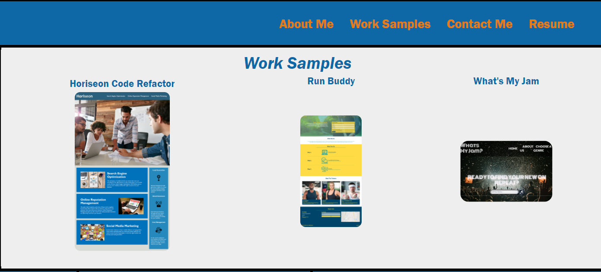

# Personal-Portfolio

## General Info
This project calls for the creation of my personal portfolio website. I will be using my knowledge of html and css to create a unique portfolio webpage that I will be able to alter in the future.

## Layout Design

This project is formatted to give the viewer an instant look at who I am professionally with my avatar front and center alongside my work portfolio. 

The links to the work samples all work and the contact me information links to the appropriate website/phone number. 

## Styling Choices
I chose colors that I personally enjoy along with an off-white to help make my Work Samples section pop out. 

I wanted the header and nav to be sticky so that as my portfolio was updated in the future and the sections changed, viewers would still be able to find what they needed quickly at the touch of a button.

## Features
I chose to make my work sample titles change color on hover to give the page a little extra. 

This effect was replicated in the Contact Me section along with an enlarged font size to encourage viewers to click on the links. 

The images of my work samples also enlarge on hover to give the viewer a sense of what they will be looking at. 

I added the hidden text below my phone number as a cheeky way to let potential callers know to leave a message so I can get back to them. 

To help make the website responsive on mobile devices I utilized flex properties in various sections and also applied media queries.

## Github Link and Active Link
    Github link: git@github.com:hvphan1993/Personal-Portfolio.git
    Active link: 